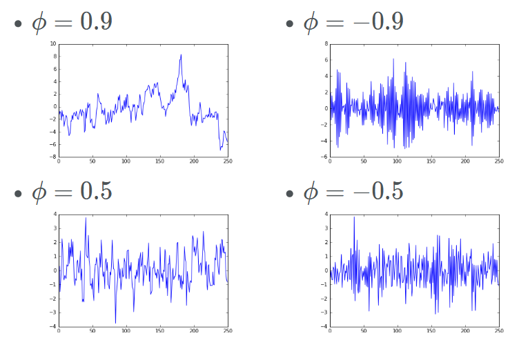
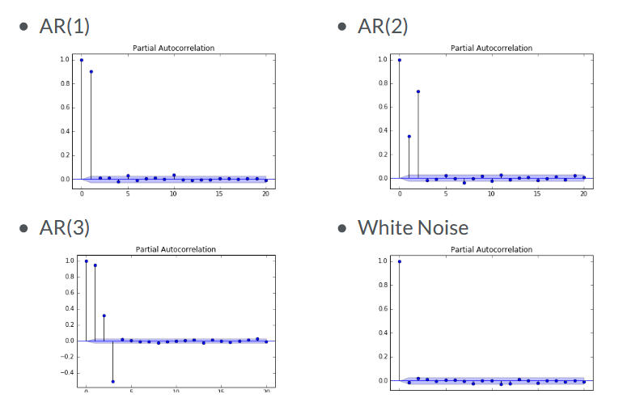
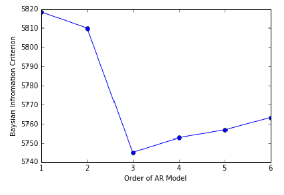
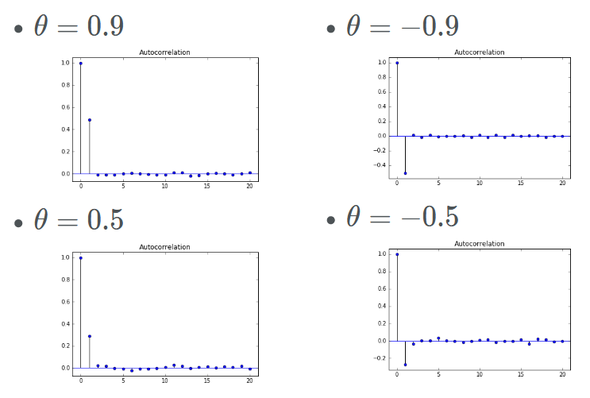
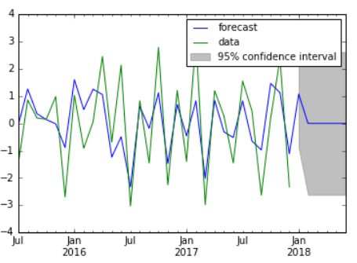

*The content is from the DataCamp course "Time Series Analysis in Python".  

- If the index of a dataframe is DatetimeIndex, the dataframe is a timeseries.

```python
import pandas as pd
from datetime import datetime

time_stamp = pd.Timestamp('2020-06-12')  # equivalent of pd.Timestamp(datetime(2020, 06, 12))
# pd.Timestamp(year = 2020, month = 06, day = 12, hour = 10, second = 49, tz = 'US/Central') 
time_stamp.year # .month .week .day
time_stamp.day_name()  # Friday
time_stamp.weekday()  # 4  (starts from Monday=0)

period = pd.Period('2020-06', 'M')  # If we omit 'M', it defaults to it. The defaul frequency for '2020-06-01' is day
                                    # M:'month end', MS:'month start', BM: 'business month end', BMS: 'business month start'
period.asfreq('D')  # Period('2020-06-30', 'D')
period.to_timestamp()  # Timestamp('2020-06-01 00:00:00')
time_stamp.to_period('M')  # Period('2020-06', 'M')
period + 1  # Period('2020-07', 'M')
# timestamp can also have frequency
ts = pd.Timestamp('2020-06-12', 'M')
ts + (2 * ts.freq)  # Timestamp('2020-07-31 00:00:00', freq='M')
```
#### Sequence of dates and times
```python
index = pd.date_range('2020-06-12', periods=3, freq='D')  # DatetimeIndex(['2020-06-12', '2020-06-13', '2020-06-14'], dtype='datetime64[ns]', freq='D')
index[0]  # Timestamp('2020-06-12 00:00:00', freq='D')
period_index = index.to_period()  # PeriodIndex(['2020-06-12', '2020-06-13', '2020-06-14'], dtype='period[D]', freq='D')
period[0]  # Period('2020-06-12', 'D')

data = np.random.random((3,2))  # array of random numbers, 3 rows, 2 columns
df = pd.DataFrame(data, index=index)  
# if index is part of the data as a column, we use set_index: df.set_index('index_col', inplcae=True)
# if date column doesn't have the datetime type, we can convert it: data.date = pd.to_datetime(data.date)
 	              0 	      1
2020-06-12 	0.160132 	0.500385
2020-06-13 	0.287287 	0.539113
2020-06-14 	0.749582 	0.899299
# We can indicate the index when loading from CSV
data = pd.read_csv('data.csv', parse_dates=['date_col'], index_col='date_col')

import matplotlib.pyplot as plt
data[data.columns[-1]].plot()  # one column
data.plot(subplots=True)  # all columns
# plt.tight_layout()
plt.show()
```

#### Partial Index
```python
# *** use string, not int ***
data['2020']  # all rows that their time is in 2020
data['2020-01': '2020-06']  # inclusive
data.loc['2020-04-01', 'target_col']  # specific value. use .reset_index(drop=True) to select column with the default numerical index
data.asfreq('D')  # if data doesn't have freq, we can add it using asfreq().
                  # this cause NaN values for the dates that the index doesn't cover
                  # 'D' is for calendar days. 'B' is for business days

data['shifted'] = data.target_col.shift(periods=1)  # copies the data from previous line (periods=1 is default)
data['change'] = data.target_col.div(data.shifted)
data['pct_change'] = data.change.sub(1).mul(100)  # subtract by 1 any multiply by 100. e.g. if change is 1.1, this means 10% increase.
data['pct_change2'] = data.target_col.pct_change().mul(100)  # equivalent of previous operations
data['diff'] = data.target_col.diff()  # the difference between the value of the cell in the current row and its value in the previous row
# all these methos have the attribute 'period' which determines how many lines back or forward to look.
```
when we have multiple columns, to normalize data, we divide values by the value of the first row and multiply by 100
so all columns start with 100
```python
prices = pd.read_csv('asset.csv', parse_dates=['DATE'], index_col='DATE')
first_row_prices = prices.iloc[0]
normalized = prices.div(first_row_prices).mul(100)
```
#### Compare the performance of two things with a benchmark
```python
stock_1_2 = pd.read_csv('s1_2.csv', parse_dates=['date'], index_col='date')
stock_3 = pd.read_csv('s3.csv', parse_dates=['date'], index_col='date')
data = pd.concat([stock_1_2, stock_3], axis=1).dropna()
normalized = data.div(data.iloc[0]).mul(100)  # normalize data
normalized['col1', 'col2'].sub(normalized['col3'], axis=0)  # subtract col3 from the two columns
```
#### Up-sampling/down-sampling
use resample, or asfreq
for upsample we need to fill out the null values. `.ffill()`, `.bfill()`, ...  
for downsample we need to determine how the new values are defined. `.mean()`, `.first()`, `.last()`, ...  
  
reindex: replace the current index with the given index
```python
new_index = pd.date_range(start='2020', periods=12, freq='M')
df.reindex(new_index)  # there is a 'method' option with possible values {None, ‘backfill’/’bfill’, ‘pad’/’ffill’, ‘nearest’}
                       # which determines how the null values should be treated (default None, i.e. don't change them)
```
resample is more general version of asfreq. It is like groupby 
```python
df.resampl(rule='M', how='last')  # or df.resample('M').last()
ts.resample('MS').ffill().add_suffix()  # add_suffix adds a suffix to the column name
ts.resample('MS').interpolate()
ts.resample('MS').mean()  # if we do ts.asfreq().mean() it outputs the mean of the whole column, not week-by-week as in resample('W')
ts.resample('M').agg(['mean', 'median', 'std'])  # creating multiple columns for different measures
# .ffil(), .intepolate() and other relevant methods can be applied to any time series data, we don't have to use resample() first.
# if applied to a dataframe, it gets applied to all columns
```

### Window functions 
```python
# .rolling()
# moving average:
data.col.rolling(window='30D').mean()  # .rolling has the 'min_periods' option: Minimum number of observations in window required to have a value
q10 = data.col.rolling.quantile(0.1).to_frame('q10')  # if we are adding to a df, we don't need the to_frame() call (e.g. data['q10'] = ...
median = rolling.median().to_frame('median')
q90 = data.col.rolling.quantile(0.9).to_frame('q90')
pd.concat(['q10','median','q90'], axis=1).plot()

# .expanding 
df.col.expanding.sum()  # same as df.col.cumsum()
df.col.expanding.max()  # running maximum
```

#### Example: cumulative return
single period return r_t: current price over last price minus 1 [r_t = p_t/p_{t-1}) - 1]  
multi period return: product of (1 + r_t) for all  periods minus 1 [(1 + r_1) * ... * (1 + r_T) - 1]
```python
returns = data.pct_change()
returns_plus_one = returns.add(1)  # -0.005 pct_change becomes 0.995 
cumulative_return = returns_plus_one.cumprod().sub(1)  # multiplying rows up to the current row
```
#### Example: cumulative for rolling 1-year period
```python
def multi_period_return(period_returns):
    return np.prod(period_returns + 1) - 1
daily_returns = data.pct_change()
rolling_annual_returns = daily_returns.rolling('360D').apply(multi_period_return)
rolling_annual_returns.mul(100).plot()
```
#### total return
```python
data.iloc[-1].div(data.iloc[0]).sub(1).mul(100)
```

## AutoCorrelation
default is lag 1
```python
df.autocorr()
```
Autocorrelation function (ACF) calculates autocorrelation for different lags. It show how many past data points can affect the current data point (the ones further from zero), or which data points can be used if for example there is a seasonal pattern.
```python
from statsmodels.tsa.stattools import acf
acf(my_series)
```
Plotting the autocorrelation function
```python
from statsmodels.graphics.tsaplots import plot_acf
plot_acf(x,
         lags=20,  # how many lags to plot
         alpha=.05  # statistical significance. for alpha=0.05 it plots 95% confidence interval as an area
        )
```
## White Noise
A series with
- Constant mean and variance
- close to zero autocorrelation (< 0.05) at all lags  
If the data has narmal distribution, it is called Gaussian White Noise
```python
noise = np.random.normal(loc=0,  # mean
                         scale=1, # standard deviation
                         size=100
                         )
plt.plot(noise)
```
The returns on the Stock Market are very close to a white noise process.

## Random Walk
In a random walk, the current value is the result of previous value plus some noise:
```
P_t = P_{t-1} + e_t
```
Therefore the change in value between two consecuive data points is white noise:
```
P_t - P_{t-1} = e_t
```
In a random walk with drift, values on average drift by `mu` every period:
```
P_t = μ + P_{t-1} + e_t
```
The change of value in this case is white noise with mean of `μ`:
```
P_t - P_{t-1} = μ + e_t
```
To test whether series follows a random walk, we can fit a line:
```
P_t = α + β * P_{t-1} + e_t
```
If the slope coefficient (`β`) is not significantly different from 1, then we cannot reject the null hypothesis that the series is a random walk.  
An equavalent way of testing for the random walk, fit a line for change of value:
```
P_t - P_{t-1} = α + (β - 1) * P_{t-1} + e_t
              = α + (β)' * P_{t-1} + e_t
```
Now if the slope (`β'`) is not significantly different from 0, we cannot reject the null hypothesis.  
This is called the Dicky-Fuller test.
```python
from statsmodels.tsa.stattools import adfuller  # Augmented Dicky-Fuller test
print(adfuller(noise))  # by default it is without drift. 
                        # use the 'regression' option for including drift: 
                        # https://www.statsmodels.org/stable/generated/statsmodels.tsa.stattools.adfuller.html
# (-11.097411854413464, -> The more negative this value is, the more likely we are to reject the null hypothesis 
#  3.942056384849988e-20,  -> p-value
#  0,  -> number of lags used
#  99,  -> number of observations used (i.e. data points)
#  {'1%': -3.498198082189098,
#   '5%': -2.891208211860468,
#   '10%': -2.5825959973472097},
#  253.62064323694332)
```
If the p-value is less than 0.05 we can reject the null hypothesis (that the series is a random walk) with 95% confidence.
Here p-value is way less than 5% and the null hypothesis is rejected. This is because the the our data is noise. So each data point is completely independent of the previous data point. Which means it definitely cannot be a random walk.
- The AutoCorrelation for a Random Walk is very high, because for example for lag1, the value differ with the original value by the noise value. For for lag2 the autocorrelation value is squared, which makes it smaller.


## Stationary
- **Strong Stationarity**: Entire distribution of data is time-invariant
- **Weak Stationarity** (easier to measure): Mean, Variance and AutoCorrelation are time-invariant (AutoCorrelation function `autocorr(X_t, X_{t+\tau})` only depends on `\tau`.
- White noise has constant Mean and Variance and close-to-zero AutoCorrelation in all lags, so it's ordinarily a stationary process.
- In Random Walks the variance in wider intervals in bigger than the variance in smaller intervals, so a Random Walk is not a stationary process.
- Seasonal series are not stationary because the mean depends on the time of year.
- If a process is not stationary, its parameters change over time, so it is hard to model.
- Many non-stationary series can be made stationary by transforming them. 
  - If we take the first differences of a Random walk series (i.e. difference of each point with the point before), the result becomes white noise which is stationary.  
  - If the data has seasonal property, we should take the seasonal difference: e.g. `ts.diff(4)`  
  - If the data is growing exponentially over time, we should take the log.
- In the below images only the top-left series is stationary. In the top-right image the mean is increasing with time, in the bottom-left image the variance is increasing with time, and the bottom-right image is similar to a random-walk and the variance in wider intervals in bigger than the variance in smaller intervals.  


## AR Models
- AR(1): `R_t = μ + φ * R_{t-1} + e_t`  
- When `φ = 1` we have a random walk. 
- When `φ = 0` we have white noise.
- For stationarity, `φ` shoud be in (-1, 1).  

AR(1) TimeSeries with different values of `φ`  
  
AR(1) AutoCorrrelation  
  

Simulated AR(1) data
```python
from statsmodels.tsa.arima_process import ArmaProcess

# AR parameter = +0.9
ar1 = np.array([1, -.9])  # the negative of the parameter is used
ma1 = np.array([1])
AR_object1 = ArmaProcess(ar1, ma1)
simulated_data = AR_object1.generate_sample(nsample=1000)
plt.plot(simulated_data)

from statsmodels.graphics.tsaplots import plot_acf
plot_acf(simulated_data, alpha=1, lags=20)
```
Estimating parameters of an AR model
```python
from statsmodels.tsa.arima_model import ARMA

# Fit an AR(1) model to the simulated data
mod = ARMA(simulated_data, order=(1,0))
res = mod.fit()
print(res.summary())
print(res.params)  # returns μ and φ

res.plot_predict(start=990, end=1010) if data has index we can use plot_predict(start='2020-08-01', end='2020-10-01')
plt.show()
```
In practice, we need to consider different AR models and choose the one that model it better. We can use two factors for deciding this:  
1. Partial AutoCorrelation Function: This helps us to see whether higher order AR models have any benefit for modelling our data.

2. Information Criteria: The more parameters in a model (i.e. the higher the order of AR model), the better it fits the data, but at the same time the higher the chance of overfitting. Information Criteria helps by penalizing for the high number of parameters. Two common information criteria are AIC and BIC. The lower these values the better
```Python
mod = ARMA(simulated_data, order=(1,0))
res = mod.fit()
print(res.aic)
print(res.bic)
```
BIC for different orders of models. The best model is AR(3). 
```python
BIC = np.zeros(7)
for p in range(7):
    mod = ARMA(simulated_data_2, order=(p,0))
    res = mod.fit()
    BIC[p] = res.bic
```


## MA Models
- MA(1): `R_t = μ + e_t + θ * e_{t-1}` (mean + noise + last period's noise)
- When `θ = 0` it becomes white noise.
- MA models are stationary for all values of θ
- The lag-1 autocorrelation for an MA(1) model is not θ (as was for AR(1) model), but rather `θ/(1+θ2)`.

AutoCorrelation of MA(1) model for different values of `θ`:


High-frequency stock returns (e.g. per minute) is a good example of MA(1) model.

```python
from statsmodels.tsa.arima_process import ArmaProcess
ar1 = np.array([1])
ma1 = np.array([1, 0.9])  # we don't need to put the negative of the parameter like AR model
MA_object1 = ArmaProcess(ar1, ma1)
simulated_data_1 = MA_object1.generate_sample(nsample=1000)
```
- The model-fitting, forecast and the rest is the same as AR(1) model, but now we use `order=(0,1)`.
- All forecast beyond the one-step-ahead forecast is the same (unlike AR(1) model).  

