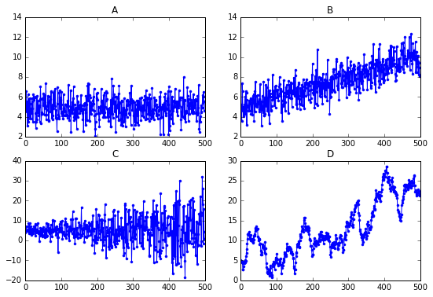
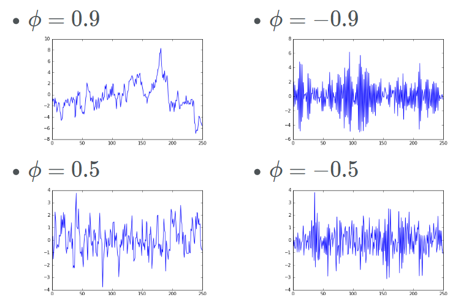
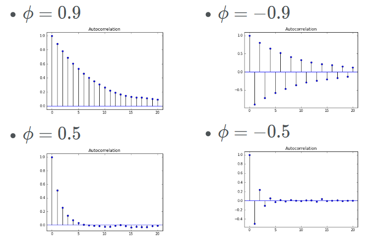
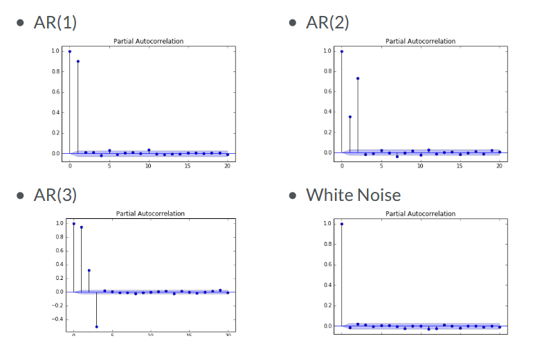
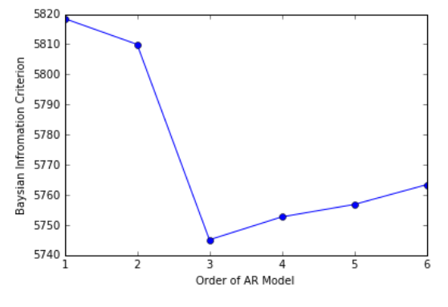
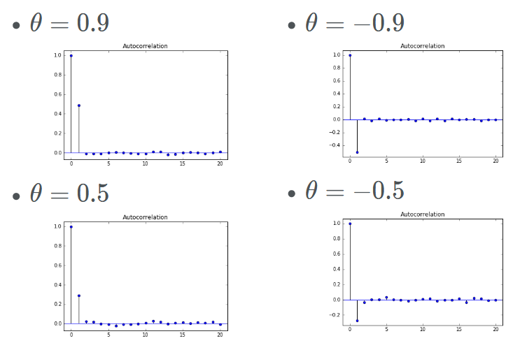
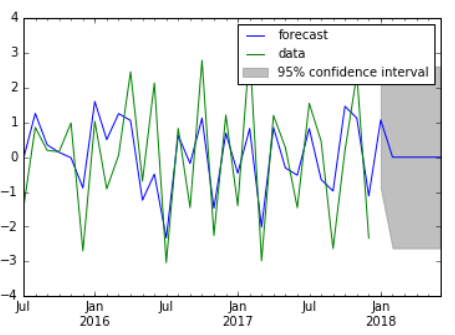

## AutoCorrelation
default is lag 1
```python
df.autocorr()
```
Autocorrelation function (ACF) calculates autocorrelation for different lags. It shows how many past data points can affect the current data point (the ones further from zero), or which data points can be used if for example there is a seasonal pattern.
```python
from statsmodels.tsa.stattools import acf
acf(my_series)
```
Plotting the autocorrelation function
```python
from statsmodels.graphics.tsaplots import plot_acf
plot_acf(x,
         lags=20,  # how many lags to plot
         alpha=.05  # statistical significance. for alpha=0.05 it plots 95% confidence interval as an area
        )
```
## White Noise
A series with
- Constant mean and variance
- close to zero autocorrelation (< 0.05) at all lags  
If the data has narmal distribution, it is called Gaussian White Noise
```python
noise = np.random.normal(loc=0,  # mean
                         scale=1, # standard deviation
                         size=100
                         )
plt.plot(noise)
```
The returns on the Stock Market are very close to a white noise process.

## Random Walk
In a random walk, the current value is the result of previous value plus some noise:
```
P_t = P_{t-1} + e_t
```
Therefore the change in value between two consecuive data points is white noise:
```
P_t - P_{t-1} = e_t
```
In a random walk with drift, values on average drift by `mu` every period:
```
P_t = μ + P_{t-1} + e_t
```
The change of value in this case is white noise with mean of `μ`:
```
P_t - P_{t-1} = μ + e_t
```
To test whether series follows a random walk, we can fit a line:
```
P_t = α + β * P_{t-1} + e_t
```
If the slope coefficient (`β`) is not significantly different from 1, then we cannot reject the null hypothesis that the series is a random walk.  
An equavalent way of testing for the random walk is to fit a line for change of value:
```
P_t - P_{t-1} = α + (β - 1) * P_{t-1} + e_t
              = α + (β)' * P_{t-1} + e_t
```
Now if the slope (`β'`) is not significantly different from 0, we cannot reject the null hypothesis.  
This is called the Dicky-Fuller test.
```python
from statsmodels.tsa.stattools import adfuller  # Augmented Dicky-Fuller test
print(adfuller(noise))  # by default it is without drift. 
                        # use the 'regression' option for including drift: 
                        # https://www.statsmodels.org/stable/generated/statsmodels.tsa.stattools.adfuller.html
# (-11.097411854413464, -> The more negative this value is, the more likely we are to reject the null hypothesis 
#  3.942056384849988e-20,  -> p-value
#  0,  -> number of lags used
#  99,  -> number of observations used (i.e. data points)
#  {'1%': -3.498198082189098,
#   '5%': -2.891208211860468,
#   '10%': -2.5825959973472097},
#  253.62064323694332)
```
If the p-value is less than 0.05 we can reject the null hypothesis (that the series is a random walk) with 95% confidence.
Here p-value is way less than 5% and the null hypothesis is rejected. This is because that **our data is noise. So each data point is completely independent of the previous data point. Which means it definitely cannot be a random walk.**
- The AutoCorrelation for a Random Walk is very high, because for example for lag1, the value differs with the original value by the noise value. For lag2 the autocorrelation value is squared, which makes it smaller.


## Stationary
- **Strong Stationarity**: Entire distribution of data is time-invariant
- **Weak Stationarity** (easier to measure): Mean, Variance and AutoCorrelation are time-invariant (AutoCorrelation function `autocorr(X_t, X_{t+\tau})` only depends on `\tau`.
- White noise has constant Mean and Variance and close-to-zero AutoCorrelation in all lags, so it's ordinarily a stationary process.
- In Random Walks the variance in wider intervals in bigger than the variance in smaller intervals, so a Random Walk is not a stationary process.
- Seasonal series are not stationary because the mean depends on the time of year.
- If a process is not stationary, its parameters change over time, so it is hard to model.
- Many non-stationary series can be made stationary by transforming them. 
  - If we take the first differences of a Random walk series (i.e. difference of each point with the point before), the result becomes white noise which is stationary.  
  - If the data has seasonal property, we should take the seasonal difference: e.g. `ts.diff(4)`  
  - If the data is growing exponentially over time, we should take the log.
- In the below images only the top-left series is stationary. In the top-right image the mean is increasing with time, in the bottom-left image the variance is increasing with time, and the bottom-right image is similar to a random-walk and the variance in wider intervals in bigger than the variance in smaller intervals.  



## AR Models
- AR(1): `R_t = μ + φ * R_{t-1} + e_t`  
- When `φ = 1` we have a random walk. 
- When `φ = 0` we have white noise.
- For stationarity, `φ` shoud be in (-1, 1).  

AR(1) TimeSeries with different values of `φ`  
  
AR(1) AutoCorrrelation  
  

Simulated AR(1) data
```python
from statsmodels.tsa.arima_process import ArmaProcess

# AR parameter = +0.9
ar1 = np.array([1, -.9])  # the negative of the parameter is used
ma1 = np.array([1])
AR_object1 = ArmaProcess(ar1, ma1)
simulated_data = AR_object1.generate_sample(nsample=1000)
plt.plot(simulated_data)

from statsmodels.graphics.tsaplots import plot_acf
plot_acf(simulated_data, alpha=1, lags=20)
```
Estimating parameters of an AR model
```python
from statsmodels.tsa.arima_model import ARMA

# Fit an AR(1) model to the simulated data
mod = ARMA(simulated_data, order=(1,0))
res = mod.fit()
print(res.summary())
print(res.params)  # returns μ and φ

res.plot_predict(start=990, end=1010)  # if data has index we can use plot_predict(start='2020-08-01', end='2020-10-01')
plt.show()
```
In practice, we need to consider different AR models and choose the one that models the data better. We can use two factors for deciding this:  
1. Partial AutoCorrelation Function: This helps us to see whether higher order AR models have any benefit for modelling our data. It shows only the effect of the chosen lag (i.e. for each lag, it doesn't consider the effect of other lags)

2. Information Criteria: The more parameters in a model (i.e. the higher the order of AR model), the better it fits the data, but at the same time the higher the chance of overfitting. Information Criteria helps by penalizing for the high number of parameters. Two common information criteria are AIC and BIC. The lower these values are the better the model is
```Python
model = ARMA(simulated_data, order=(1,0))
res = model.fit()
print(res.aic)
print(res.bic)
```
BIC for different orders of models. The best model is AR(3). 
```python
BIC = np.zeros(7)
for p in range(7):
    model = ARMA(simulated_data_2, order=(p,0))
    res = model.fit()
    BIC[p] = res.bic
```


## MA Models
- MA(1): `R_t = μ + e_t + θ * e_{t-1}` (mean + noise + last period's noise)
- When `θ = 0` it becomes white noise.
- MA models are stationary for all values of θ
- The lag-1 autocorrelation for an MA(1) model is not θ (as was for AR(1) model), but rather `θ/(1+θ**2)`.

AutoCorrelation of MA(1) model for different values of `θ`:


High-frequency stock returns (e.g. per minute) is a good example of MA(1) model.

```python
from statsmodels.tsa.arima_process import ArmaProcess
ar1 = np.array([1])
ma1 = np.array([1, 0.9])  # we don't need to put the negative of the parameter (as we did for AR models)
MA_object1 = ArmaProcess(ar1, ma1)
simulated_data_1 = MA_object1.generate_sample(nsample=1000)
```
- The model-fitting, forecast and the rest is the same as AR(1) model, but now we use `order=(0,1)`.
- All forecast beyond the one-step-ahead forecast is the same (unlike AR(1) model).  

- An AR(1) model is equivalent to an MA(∞) model

## Cointegration
- It may be the case that the liner combination of two random walk series is not a random walk. In this case the two series are cointegrated. So although the tho series are not forcastable, their linear combination is.
- Example: dog on a leash. Movement of Human and dog may be random but their distance is mean-reverting.
- Example: price of natural gas and heating oil. They compete for demand, if one goes two high, the demand for other one increased which reduces the demand for the first one and so reduces its price.
- To check for cointegration, we regress one of the series (P_t) on the other (Q_t) to find the slope c . Then run augmented dicky-fuller test on `P_t - c*Q_T` to check for random walk. Alternatively we can use the function `coint()` from statmodels.
```python
import statsmodels.api as sm
from statsmodels.tsa.stattools import adfuller

# Regress series1 on series2
ETH = sm.add_constant(series1)
result = sm.OLS(series1, series2).fit()

# Compute ADF
b = result.params[1]
adf_stats = adfuller(series1['Price'] - b*series2['Price'])
print("The p-value for the ADF test is ", adf_stats[1])
```
## Project (Climate Change)
ARMA models are too simplistic to model climate, but just for the sake of excercise.
```python
# Import the adfuller function from the statsmodels module
from statsmodels.tsa.stattools import adfuller

# Convert the index to a datetime object
temp_NY.index = pd.to_datetime(temp_NY.index, format='%Y')
# Plot average temperatures
temp_NY.plot()
plt.show()

# Compute and print ADF p-value
result = adfuller(temp_NY['TAVG'])

### The data seems to follow a random walk with drift.

# Import the modules for plotting the sample ACF and PACF
from statsmodels.graphics.tsaplots import plot_acf, plot_pacf

# Take first difference of the temperature Series
chg_temp = temp_NY.diff()
chg_temp = chg_temp.dropna()

# Plot the ACF and PACF on the same page
fig, axes = plt.subplots(2,1)

# Plot the ACF
plot_acf(chg_temp, lags=20, ax=axes[0])

# Plot the PACF
plot_pacf(chg_temp, lags=20, ax=axes[1])
plt.show()
print("The p-value for the ADF test is ", result[1])

### There is no clear pattern in the ACF and PACF except the negative lag-1 autocorrelation in the ACF.

# Import the module for estimating an ARMA model
from statsmodels.tsa.arima_model import ARMA

# Fit the data to an AR(1) model and print AIC:
mod_ar1 = ARMA(chg_temp, order=(1, 0))
res_ar1 = mod_ar1.fit()
print("The AIC for an AR(1) is: ", res_ar1.aic)

# Fit the data to an AR(2) model and print AIC:
mod_ar2 = ARMA(chg_temp, order=(2, 0))
res_ar2 = mod_ar2.fit()
print("The AIC for an AR(2) is: ", res_ar2.aic)

# Fit the data to an ARMA(1,1) model and print AIC:
mod_arma11 = ARMA(chg_temp, order=(1,1))
res_arma11 = mod_arma11.fit()
print("The AIC for an ARMA(1,1) is: ", res_arma11.aic)

### The ARMA(1,1) has the lowest AIC values among the three models.

# Import the ARIMA module from statsmodels
from statsmodels.tsa.arima_model import ARIMA

# Forecast temperatures using an ARIMA(1,1,1) model
mod = ARIMA(temp_NY, order=(1,1,1))
res = mod.fit()

# Plot the original series and the forecasted series
res.plot_predict(start='1872-01-01', end='2046-01-01')
plt.show()

### According to the model, the temperature is expected to be about 0.6 degrees higher in 30 years 
### (almost entirely due to the trend), but the 95% confidence interval around that is over 5 degrees.
```
