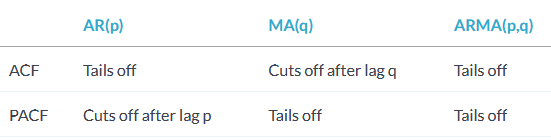
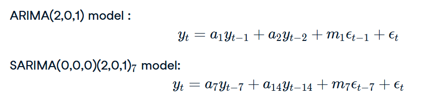
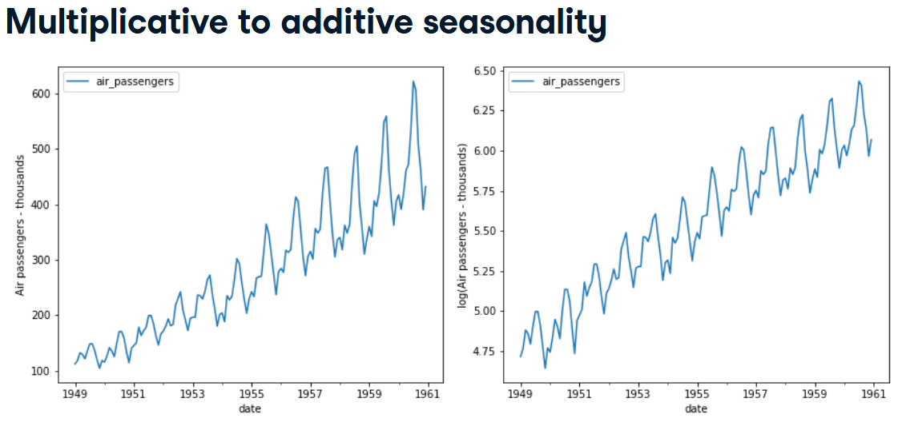

- After fitting the model, the next value of the time series can be predicted by replacing the coffecients in the formula.  
For example for an AR(1) model we have `y_t = a_1 * y_{t-1} + e_t`. Suppose the current value is 10 and the coefficient from fitting the model (here, the lag1 coefficient) is .8 and the standard deviation of error ('std err' in the summary) is 1. Then for the next value x we have: `0.8 * 10 - 1 < x < 0.8 * 10 + 1`. This is called *one-step-ahead prediction*. In this method each new value is calculated by applying the coefficients to the current and previous values (depending on how many lags we consider in the model) and adding the standard deviation.

```python
from statsmodels.tsa.arima_model import ARMA

# Fit an AR(1) model to the simulated data
mod = ARMA(data, order=(1,0))  # data can be df, series or Numpy array
res = mod.fit()
print(res.summary())
print(res.params)  # returns μ and φ
print(res.aic)
print(res.bic)

from statsmodels.tsa.statespace.sarimax import SARIMAX  # this can do all the things the previous module could do and more
model = SARIMAX(data, order=(1,0,0))  # AR(1) model
# if the timeseries isn't centered around zero, we should add a constant to the model by using the option "trend='c'".
model = SARIMAX(data, order=(1,0,0), trend='c')
# if there is seasonality
model = SARIMAX(data, order=(1,0,0), seasonal_order=(0, 1, 1, 12), trend='c')
res = model.fit()

# in-sample prediction 
forecast = res.get_prediction(start = -10) # how many steps back to start the prediction
                                           # set `dynamic=True` for dynamic prediction. That is the value  at 'start' is calculated using 
                                           # the previous value and the error. Then the value for start + 1 is calculated using previously calculated value and so on.
mean_forecast = forecast.predicted_mean
confidence_intervals = forecast.conf_int()  # a df with lower and upper limits

# future forecasts (this is always dynamic for steps > 1)
forecast = res.get_forecast(steps=10) 
mean_forecast = forecast.predicted_mean
confidence_intervals = forecast.conf_int()  # a df with lower and upper limits

res.plot_predict(start=990, end=1010)  # if data has index we can use plot_predict(start='2020-08-01', end='2020-10-01')
plt.show()
```
#### X (eXogenous)
ARMAX is for using external (AKA exogenous) variables in addition to the timeseries variables. (ARMA + linear regression)
```python
# ARMAX(1,1)
y_t = x_1 * z_t + a_1 * y_{t-1} + m_1 * e_{t-1} + e_t
```
Example: For Modellig personal productivity in the current day, we may include productivity in previous days (timeseries variable) and the number of hours slept last night (external variable).
```python
model = ARMA(df['productivity'], order=(2,1), exog=df['hours_sleep'])
```
#### I (Integrated)
To model non-stationary data we need make it stationary (for example by taking the difference). After modeling and making forecast, we need to transform the predicted value of the diffs back to a forecast of the original timeseries. For non-stationary data that can be made stationary by taking difference, the above steps are automatically done if we use a model that includes `I` (e.g. ARIMA).
```python
model = SARIMAX(df, order=(p, d, q))  # the value of parameter d tells the model how many times the diff should be applied.
```
We use the Dicky-Fuller test to find the best value for d. We start by 0 and increment, and choose the first value that gives good result. We don't want to overfit.

### Criteria for Choosing the model
- Plot ACF and PACF and choose the model based on the results
```python
fig, (ax1, ax2) = plt.subplots(2,1, figsize=(12,8))
plot_acf(earthquake, lags=15, zero=False, ax=ax1)
plot_pacf(earthquake, lags=15, zero=False, ax=ax2)
```


Note that in the third case, the values of p and q is not determined using the plots.

So for detecting value of p in MA(p) models we can use acf but for AR models acf doesn't work and we need pacf.  
The reason that acf doesn't work for AR models is that all previous values affect the current value (although the further back we go the effect decreases), because of the formulation of AR models. But in MA models only previous noises affect the current value which is negligible.

- Using AIC and BIC
  - These penalize the complicated models, so prevent overfitting
  - The lower these numbers the better
  - AIC and BIC are similar, but BIC penalizes more than AIC.
  - AIC is better at choosing predictive models
  - BIC is better at choosing explanatory models
  - 
  ```python
  res = model.fit()
  print(res.aic, res.bic)
  ```
  - Trying different values
  ```python
  for p in range(4):
      for q in range(4):
        try:
          model = SARIMAX(savings, order=(p,0,q), trend='c')
          results = model.fit()
          print(p, q, results.aic, results.bic)
        except:
          print(p, q, None, None)
  ```
### Model Diagnosis
Ideally residuals should be white Gaussian noise.
```python
residuals = res.redid  # residuals (difference between the one-step ahead predictions and the actual values)
mae = np.mean(np.abs(residuals))

results.plot_diagnostics()  # generates four plots to see if residuals are white noise 
```
In the `results.summary()` output:
- `Prob(Q)`: p-value for null hypothesis that residuals are uncorrelated
- `Prob(JB)`: p-value for null hypothesis that residuals are Gaussian
If they are less than 0.05, we can reject that hypothesis.

### Box - Jenkins Method
- Identification
  - plot the series and use ADF test to see whether the series is stationary
  - If it is not, make it stationary by transforming it. 
  - identify good candidates for p and q using ACF and PACF
- Estimation
  - fit the model to the data `model.fit()`
  - choose AIC and BIC to norrow down to more promising candidate
- Model diagnosis
  - use `.summary()` stats and `.plot_diagnostics()` to make sure the residuals are well-behaved
  - Use model diagnosis to check if the chosen p and q are correct
  - if the residuals are not ok we go back to earlier steps and rethink the choices. 
  - Otherwise we make forecasts and move to production

### Handling Seasonality
Seasonal time series can be decomposed to three elements: trend, seasonality, resudual:
```python
from statsmodels.tsa.seasonal import seasonal_decompose
# additive decomposition
decomp = seasonal_decompose(my_series, freq=12)
```
If it is not clear the data is seasonal or not, we can get help from plot_acf and plot_pacf. But before that, we need to de-trend the data if it has a trend.  
For detrending we usually take the difference. But here since we just want to find the period of the process (?), we subtract the rolling mean, where the rolling period should be bigger than the likely seasonal period:
```python
sr2 = sr - sr.rolling(15).mean()
sr2 = sr2.dropna()
```
### SARIMA
- `SARIMA(p,d,q),(P,D,Q)_S` S in the length of the seasonal cycle.


```python
model = SARIMAX(df, order=(p,d,q), seasonal_order=(P,D,Q,S))
```
- If the process has trend we take the difference, as many times as needed. This gices us `d`. 
- If the process has a seasonal component, we take the seasonal difference, as many times as needed. This gives us `D`.
- After making the data stationary (the above two steps, and other transformations if needed).
- To find P and Q, we plot acf and pacf for multiples of S. For example if `S=12`, then we plot for lags `[12, 24, 36, 48, 60]`.

```python
# Create SARIMA mean forecast
sarima_pred = sarima_results.get_forecast(steps=25)
sarima_mean = sarima_pred.predicted_mean

plt.plot(dates, sarima_mean, label='SARIMA')
plt.plot(held_out_test, label='observed')
plt.legend()
plt.show()
```
### Automation
```python
import pmdarima as pm

model1 = pm.auto_arima(df,
                      d=?,
                      start_p=?, max_p=?,
                      start_q=?, max_q=?,
                      seasonal=True, 
                      D=?,
                      m=?,  # seasonal period
                 	    start_P=?, max_P=?, 
                      start_Q=?, max_Q=?,
                      trace=True,
                      error_action='ignore',
                      suppress_warnings=True)
```

### Saving and Loading and Updating the Model
```python
import joblib  # similar to pickle

# save the model
joblib.dump(model,'model.pkl')

# load the model
loaded_model = joblib.load('model.pkl')

# Update the model with new data.
# if the data is significant, we should redo the model
loaded_model.update(df_new)
```

### Making Data Staionary
- If we take differences, we shouldn't overdo it. Rule of thumb: `D <= 1` and `d + D <= 2`.
- If the seasonality is multiplicative, i.e. the oscillation range increases with time, we should take the log first, to make it additive:


